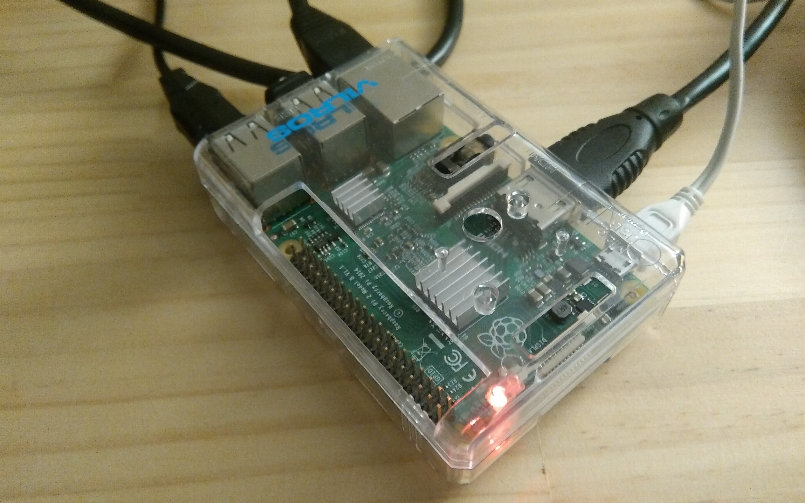
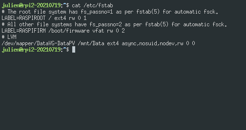
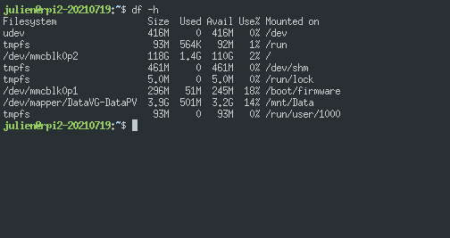
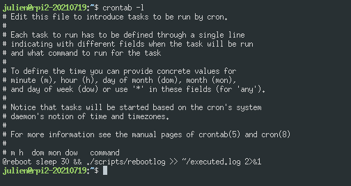
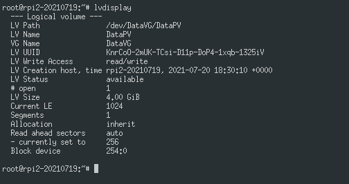
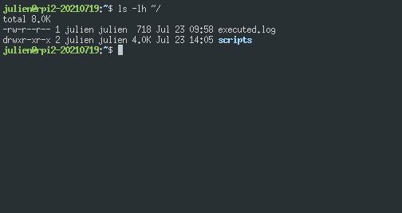
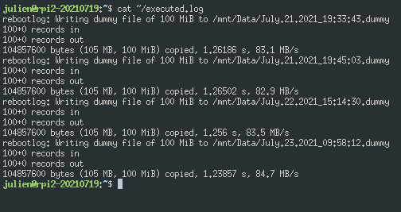

# RaspberryPi2 LVM test project

## cat /etc/fstab

    # The root file system has fs_passno=1 as per fstab(5) for automatic fsck.
    LABEL=RASPIROOT / ext4 rw 0 1
    # All other file systems have fs_passno=2 as per fstab(5) for automatic fsck.
    LABEL=RASPIFIRM /boot/firmware vfat rw 0 2
    # LVM
    /dev/mapper/DataVG-DataPV /mnt/Data ext4 async,nosuid,nodev,rw 0 0 

## df -h

    Filesystem                 Size  Used Avail Use% Mounted on
    udev                       416M     0  416M   0% /dev
    tmpfs                       93M  564K   92M   1% /run
    /dev/mmcblk0p2             118G  1.4G  110G   2% /
    tmpfs                      461M     0  461M   0% /dev/shm
    tmpfs                      5.0M     0  5.0M   0% /run/lock
    /dev/mmcblk0p1             296M   51M  245M  18% /boot/firmware
    /dev/mapper/DataVG-DataPV  3.9G  501M  3.2G  14% /mnt/Data
    tmpfs                       93M     0   93M   0% /run/user/1000

## crontab -l

    # Edit this file to introduce tasks to be run by cron.
    # 
    # Each task to run has to be defined through a single line
    # indicating with different fields when the task will be run
    # and what command to run for the task
    # 
    # To define the time you can provide concrete values for
    # minute (m), hour (h), day of month (dom), month (mon),
    # and day of week (dow) or use '*' in these fields (for 'any').
    # 
    # Notice that tasks will be started based on the cron's system
    # daemon's notion of time and timezones.
    # 
    # For more information see the manual pages of crontab(5) and cron(8)
    # 
    # m h  dom mon dow   command
    @reboot sleep 30 && ./scripts/rebootlog >> ~/executed.log 2>&1

## lvdisplay

      --- Logical volume ---
      LV Path                /dev/DataVG/DataPV
      LV Name                DataPV
      VG Name                DataVG
      LV UUID                KnrCoO-2mUK-TCsi-D11p-DoP4-1xqb-1325iV
      LV Write Access        read/write
      LV Creation host, time rpi2-20210719, 2021-07-20 18:30:10 +0000
      LV Status              available
      # open                 1
      LV Size                4.00 GiB
      Current LE             1024
      Segments               1
      Allocation             inherit
      Read ahead sectors     auto
      - currently set to     256
      Block device           254:0
 
## ls -lh ~/

    total 8K
    -rw-r--r-- 1 julien julien  718 Jul 23 09:58 executed.log
    drwxr-xr-x 2 julien julien 4.0K Jul 23 14:05 scripts

## cat ~/executed.log

    rebootlog: Writing dummy file of 100 MiB to /mnt/Data/July.21.2021_19:33:43.dummy
    100+0 records in
    100+0 records out
    104857600 bytes (105 MB, 100 MiB) copied, 1.26186 s, 83.1 MB/s
    rebootlog: Writing dummy file of 100 MiB to /mnt/Data/July.21.2021_19:45:03.dummy
    100+0 records in
    100+0 records out
    104857600 bytes (105 MB, 100 MiB) copied, 1.26502 s, 82.9 MB/s
    rebootlog: Writing dummy file of 100 MiB to /mnt/Data/July.22.2021_15:14:30.dummy
    100+0 records in
    100+0 records out
    104857600 bytes (105 MB, 100 MiB) copied, 1.256 s, 83.5 MB/s
    rebootlog: Writing dummy file of 100 MiB to /mnt/Data/July.23.2021_09:58:12.dummy
    100+0 records in
    100+0 records out
    104857600 bytes (105 MB, 100 MiB) copied, 1.23857 s, 84.7 MB/s
      
